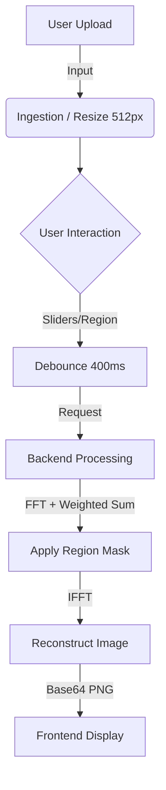

# 🎛️ Fourier Studio

> **Signal Processing Mixer** > A sophisticated web application for visualizing and mixing image signals in the Frequency Domain using React and Python.


---

### 📸 Screenshot


---

## 🚀 Features

* **Multi-Image Processing:** Upload and manipulate up to 4 images simultaneously.
* **Dual Domain Visualization:**
    * **Spatial Domain:** View original and grayscale versions.
    * **Frequency Domain:** Visualize Magnitude, Phase, Real, and Imaginary components.
* **Advanced Mixing Engines:**
    * **Magnitude / Phase Mode:** The classic "structure vs. texture" swap.
    * **Real / Imaginary Mode:** Linear combination of complex components for abstract effects.
* **Interactive Region Filtering:**
    * **Inner Pass (Low Pass):** Focus on central low-frequency components.
    * **Outer Reject (High Pass):** Focus on edge high-frequency components.
    * **Drag-and-Drop UI:** Move and resize the filter region directly on the spectrum.
* **Real-Time Architecture:**
    * Asynchronous backend processing using Python threading.
    * Optimized React frontend with debounced inputs (400ms) for smooth slider interaction.
    * **"Demo Mode":** Fallback simulation ensures the UI works even if the backend is offline.

---

## 🛠 Tech Stack

### Frontend (Client)
* **Framework:** React 18 (Vite)
* **Styling:** Tailwind CSS (Responsive, Dark Mode)
* **Icons:** Lucide React
* **State:** React Hooks (`useState`, `useEffect`, `useCallback`)

### Backend (Server)
* **Framework:** Flask (Python)
* **Processing:** OpenCV (`cv2`), NumPy
* **Math:** `numpy.fft` (FFT2, IFFT2)
* **Concurrency:** Python threading and queues for non-blocking execution

---

## ⚙️ System Architecture

### 1. Data Flow Pipeline


---

## 🧮 Math Logic

### Magnitude / Phase Mixing
Reconstructs an image using a weighted combination of magnitudes and phases from inputs $1..N$.

$$
\text{New}_{\text{spectrum}} = \left( \sum_{i=1}^{N} w_{mag,i} \cdot |F_i| \right) \cdot e^{j \cdot \left( \sum_{i=1}^{N} w_{phase,i} \cdot \angle F_i \right)}
$$

### Real / Imaginary Mixing
Creates a linear combination of the complex components.

$$
\text{New}_{\text{spectrum}} = \left( \sum_{i=1}^{N} w_{real,i} \cdot \Re(F_i) \right) + j \cdot \left( \sum_{i=1}^{N} w_{imag,i} \cdot \Im(F_i) \right)
$$

### Region Masking
A binary mask $M(u,v)$ is generated based on the selected region geometry.

$$
\text{Final}_{\text{spectrum}} = \text{New}_{\text{spectrum}} \times M(u,v)
$$

---

## 💻 Installation & Setup

### Prerequisites
* Node.js (v14+) & npm
* Python (v3.8+) & pip

### 1. Backend Setup
```bash
# Navigate to the backend folder
cd backend

# Install dependencies
pip install flask flask-cors numpy opencv-python

# Run the server
python app.py

# Server starts on [http://127.0.0.1:5000](http://127.0.0.1:5000)
```

### 2. Frontend Setup
```bash
# Navigate to the frontend folder
cd frontend

# Install dependencies
npm install

# Start the development server
npm run dev

# App lives at http://localhost:5173
```

---

## 📖 Usage Guide

1.  **Upload Images:** Click "Upload" in any of the 4 input viewports.
2.  **Inspect Frequencies:** Toggle "Frequency" mode and switch between Magnitude, Phase, Real, or Imaginary views.
3.  **Configure Region:**
    * Select **Region Mode** in the center panel.
    * Drag/Resize the box overlay on any Frequency viewport.
4.  **Mix Components:**
    * Choose **Mag/Phase** or **Real/Imag** mode.
    * Adjust sliders to set percentage contributions.
5.  **View Output:** Check Output Port 1 or 2 to see the reconstructed result.

---

## 📡 API Reference

| Endpoint | Method | Description | Payload |
| :--- | :--- | :--- | :--- |
| `/upload/<id>` | `POST` | Upload image to slot ID (1-4) | `FormData: { image: File }` |
| `/get_view/<id>/<type>` | `GET` | Get base64 view of component | `<type>`: Magnitude, Phase, etc. |
| `/start_mix` | `POST` | Start async mixing task | JSON (weights & region settings) |
| `/progress` | `GET` | Poll task status | Returns status, %, and result |

---

## 📄 License
This project is released under the **MIT License**.
